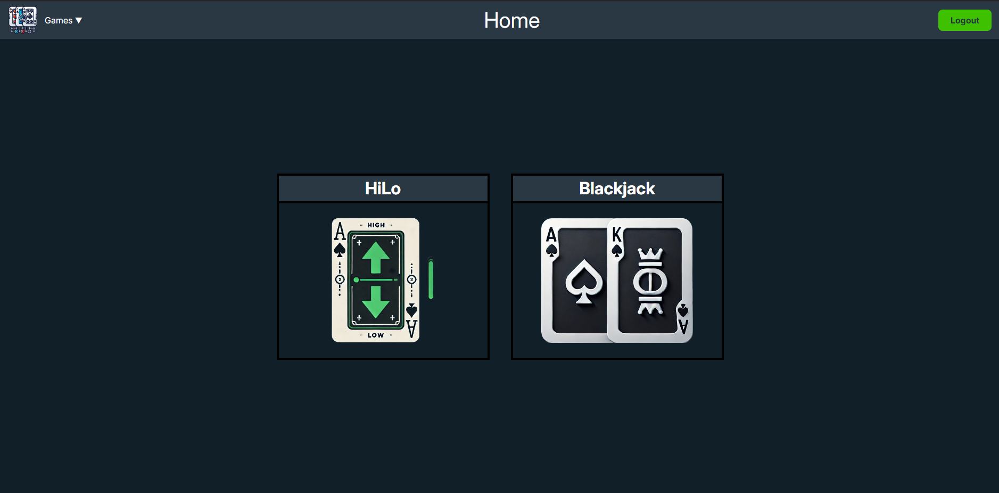

## React N' Cards

Welcome to my application. In this app users can play a total of two card games.

### HiLo

Users can play the classic cardgame Hi Lo, which let's them wager if the next card will be higher or lower than the current one.

### Blackjack

Users can play the popular cardgame Blackjack, trying to beat the dealer at getting to 21.
But beware of getting over 21 or you'll bust and lose.

### History

There is also a history overview of cards drawn over the course of your game you can lean on.
Use it to get that small edge and win!



## Getting Started

Follow these instructions to set up and run the project on your local machine.

### Prerequisites

Make sure you have the following installed on your machine:
- [Node.js](https://nodejs.org/) (LTS version recommended)
- [npm](https://www.npmjs.com/) Node package manager or any other package manager (yarn, pnpm etc.)

## Installation

1. **Clone the repository**

   ```sh
   git clone https://github.com/Kapprikorn/frontend-react-ReactnCards.git
   cd frontend-react-ReactnCards
   ```

2. **Install dependencies**

   ```sh
   npm install
   ```

### Run locally

To run the project locally you just have to start the development server with:

   ```sh
   npm run dev
   ```

   This command will start the development server and open the application in your default web browser. If it doesn't open automatically, you can manually navigate to `http://localhost:5173` in your browser.

### Environment Variables

To connect to the NOVI backend, which let you register and login, you need to setup environment variables. 
Create a `.env` file in the root of this project (same height as src folder) and define the following key there:

```plaintext
VITE_NOVI_BACKEND_API_KEY=https://api.example.com
```

## Other NPM commands

Other npm commands that can be used are as follows.

### Building for Production

To create a production build of the project:

1. **Build the project**

   ```sh
   npm run build
   ```

   The production-ready files will be generated in the `dist` folder.

2. **Preview the production build**

   ```sh
   npm run preview
   ```

   This command will start a local server to serve the production build. You can navigate to `http://localhost:5000` to see the production version of your app.

### Linting and Formatting

To lint the code and ensure it follows the defined ESLint rules:

1. **Run the linter**

   ```sh
   npm run lint
   ```

### Test account

To test things out there is already a test account added to the database

```plaintext
username: testUser
password: testUser
```
   
### Acknowledgements

- [NOVI Hogeschool](https://www.novi.nl)
  - Specifically: [Nova Eeken](https://info.novi.nl/nl/overzicht-hoofddocenten-sme) and [Elwyn de Neve](https://info.novi.nl/nl/overzicht-hoofddocenten-sme)
- [Vite](https://vitejs.dev/)
- [React](https://reactjs.org/)
